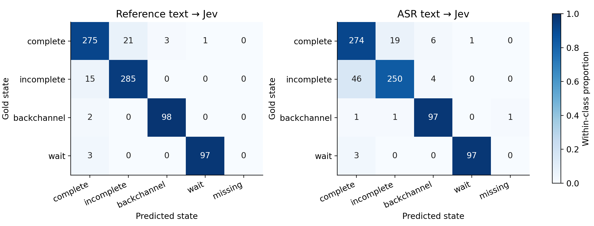
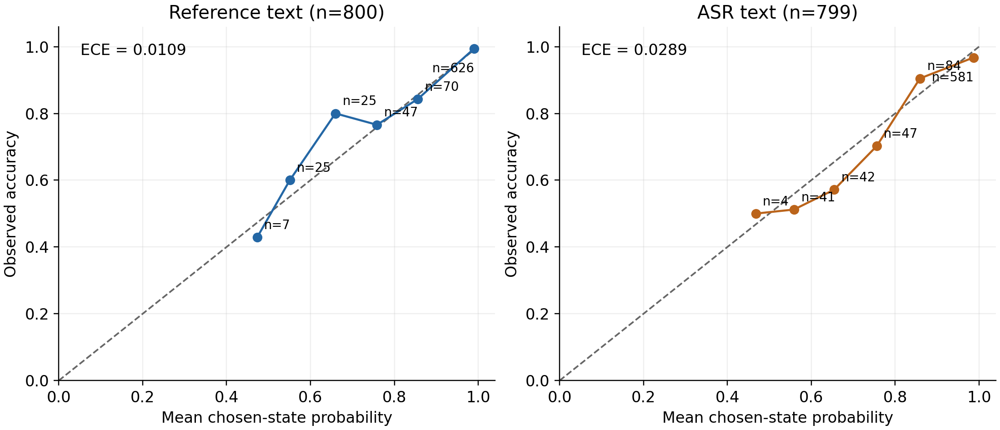

# Zero-shot Jev 在 EasyTurn 上的表现：对测试集语义偏好的一个佐证

**无需针对 EasyTurn 训练，仅将 Qwen3-ASR 的转写交给通用决策模型 Jev，四类平均正确率就达到 92.17%，距 EasyTurn 论文报告的 95.75% 相差 3.58 个百分点。使用官方参考文本时，Jev 达到 95.42%，差距进一步缩小到 0.33 个百分点。** 本项目用一个简单的文本基线，为 EasyTurn 测试集较强的语义偏好提供了佐证：大量话轮状态可以直接从文本中判断，而测试集上的高分对真实场景泛化能力的解释仍需结合跨数据集表现。

## 数据构建与训练方案为何容易形成语义偏好？

EasyTurn 的四种状态具有清晰的语义定义：complete 表示意图表达完整，incomplete 表示尚未表达完，backchannel 表示简短附和，wait 表示明确要求暂停或结束。这些定义让句子完整性、反馈用语和停止请求成为直接的分类线索。

这种倾向也体现在训练数据的构建中。真实语音先与转写对齐，再由文本模型标注和筛选状态；complete、incomplete 和 wait 主要保留 Qwen 与 TEN 判断一致的样本。合成部分先生成符合目标状态的文本，再经模型筛选、TTS 和 ASR 校验得到音频，incomplete 文本本身就按语义未完成来构造。这个流程优先保留文本中状态线索明确、语音内容容易识别的样本。[EasyTurn 第 2.1–2.2 节](https://arxiv.org/html/2509.23938v1#S2)

官方测试集包含 800 条样本，真实录音与合成语音各占一半。其转写来自训练集之外，话轮状态由人工标注，合成音频通过 CosyVoice 2 生成。结合状态的语义定义及下文的文本基线结果，可以看到，测试文本中保留了大量能够直接预测标签的线索。[官方测试集说明](https://huggingface.co/datasets/ASLP-lab/Easy-Turn-Testset/blob/main/README.md)

EasyTurn 的 Whisper 编码器与 Qwen LLM 采用 ASR+Turn-Detection：先生成转写，再预测状态。这条训练路径把语音转换为显式文本后继续判断，恰好有利于利用数据中的语义线索。论文中，完整方案的四类平均正确率为 95.75%，直接预测状态、去掉先生成转写步骤的版本为 87.88%。数据的构建方式与模型的训练目标在语义层面高度契合。[EasyTurn 第 3.2 节及表 3](https://arxiv.org/html/2509.23938v1#S3.SS2)

## 一个通用文本决策模型能接近到什么程度？

本实验使用官方测试集的全部 800 条样本：complete、incomplete 各 300 条，backchannel、wait 各 100 条。Jev 接收单条 ASR 转写或官方参考文本，依据同一组固定状态说明选择标签并返回候选概率。输入已剥离标注标签，每条独立判断。本项目没有对 Jev 进行 EasyTurn 任务训练，也没有提供 few-shot 示例。

| 模型与输入 | 总体正确率 | 四类平均正确率 |
|---|---:|---:|
| Qwen3-ASR → Jev | **89.75%**（718/800） | **92.17%** |
| 官方参考文本 → Jev | **94.38%**（755/800） | **95.42%** |
| EasyTurn（论文） | — | **95.75%** |

总体正确率按样本数加权，四类平均正确率给予每类相同权重，后者对应 EasyTurn 的 ACC_avg。ASR 有一条空转写，保留在分类分母中；其余 799 条均获得有效决策。EasyTurn 列采用论文表 2、表 3 的结果。[EasyTurn 实验结果](https://arxiv.org/html/2509.23938v1#S4.SS2)

**ASR → Jev 是本项目的核心结果：通过现成 ASR 和固定提示词，通用文本决策模型已经接近专门训练的 EasyTurn。** 参考文本对照进一步显示，当识别与文本格式的影响减少后，这个测试集中的状态几乎可以由通用文本模型同样准确地恢复。这为“测试集标签具有很强的语义可预测性”增加了一条独立实验佐证。

| 状态 | ASR → Jev | 参考文本 → Jev | EasyTurn（论文） |
|---|---:|---:|---:|
| complete | 91.33% | 91.67% | 96.33% |
| incomplete | 83.33% | 95.00% | 97.67% |
| backchannel | 97.00% | 98.00% | 91.00% |
| wait | 97.00% | 97.00% | 98.00% |

语义线索较直接的 backchannel 和 wait 上，Jev 已达到 97%–98%。参考文本条件下，真实与合成来源的总体正确率分别为 92.50% 和 96.25%；其中 complete 的来源差距最明显，真实录音为 84.00%，合成语音为 99.33%。合成样本尤其容易由文本恢复标签，与其从文本生成语音的构建路径相一致。

## 自有测试集高分与跨场景泛化之间的落差

FastTurn 的后续研究明确指出，EasyTurn 测试集规模较小、没有背景噪声、依赖语义线索，因此文本级联方法也能取得较强表现。其跨测试集评测给出了更直接的对照：

| EasyTurn 的评测数据 | 总体正确率 |
|---|---:|
| EasyTurn 自有测试集 | **96.38%** |
| FastTurn 测试集 | **78.05%** |
| Smart Turn 中文测试集 | **57.16%** |

这些数值来自 FastTurn v2 表 3，使用该论文的评测协议。FastTurn 的测试集主要来自真实双人对话，并补充了合成 wait 样本，包含重叠、附和、停顿等现象；Smart Turn 中文集采用 complete/incomplete 两类标签。跨数据集的分布与标签设置变化带来了明显性能下降。[FastTurn v2 第 2.3、3.4 节及表 3](https://arxiv.org/html/2604.01897v2#S3.SS4)

跨测试集退化与本项目的文本基线从两个方向指向同一个问题：**EasyTurn 自有测试集上的高分，很大程度上可以通过语义线索取得；真实场景中的话轮预测能力需要由独立分布上的表现继续检验。** Jev 的结果补充了一个尤其简单的参照：无需对决策模型进行任务训练，单凭 ASR 文本就能取得接近的四类平均正确率。后续评估应优先比较这些方法在语义线索较弱、口语不完整和真实对话切片上的差距。

## ASR 与概率分析补充了哪些信息？

Qwen3-ASR 的归一化字符错误率（CER）为 1.50%，其中真实录音为 2.33%，合成语音为 0.73%；去掉标点与空白后，708/800 条转写与参考文本完全一致。ASR 条件相较参考文本的总体正确率下降 4.63 个百分点，主要集中在 incomplete。

图中数字为样本数，颜色表示该标注类别内部的比例。在共同获得决策的 799 条样本上，40 条从参考文本判断正确变为 ASR 文本判断错误，4 条发生相反变化。40 条退化样本中，35 条属于 incomplete，其中 31 条被改判为 complete；该类全部样本中，被判为 complete 的数量从 15 条增至 46 条。

40 条退化样本中，33 条的两种文本在字符归一化后相同。比如“我已经尝试过了，但还是无法”被转写为带句号的版本后，Jev 从 incomplete 改判为 complete；“请问有没有其他”被补上问号后，也出现同样变化。标点变化经常伴随决策变化，进一步提示这个文本基线对文本形式的敏感性。CER 去除了标点，因而没有反映这部分差异。

概率表现也随输入变化：参考文本与 ASR 文本的 NLL 分别为 0.1464 和 0.2693，Brier 为 0.0855 和 0.1438，ECE 为 0.0109 和 0.0289。概率指标分别覆盖 800 与 799 条有效决策；Brier 使用四类误差平方和，ECE 使用十个等宽区间。

选中类别概率大于 0.9 的错误样本从参考文本条件下的 4 条增加到 ASR 条件下的 19 条。因此，迁移到另一套输入和数据分布时，应同时检查分类正确率与概率校准。下一步最有价值的实验是将相同的 ASR → Jev 基线迁移到独立话轮测试集，观察 EasyTurn、通用文本决策模型及数据语义特性之间的关系。

## 对后续全双工数据标注与合成的启示

这项结果也提醒后续数据建设：如果话轮标签主要由文本语义决定，模型就容易学到句子完整性和典型用语与状态之间的对应关系。要获得更强的话轮监督信号，需要让标注和合成流程覆盖真实对话中语义与话轮边界并不一致的情况。

**标注应把音频和对话上下文作为判断依据。** 标注者需要结合停顿、句末语调、重音、拖长、犹豫及前后话轮，判断说话者是否准备继续、是否把话轮交给对方，以及短促反馈是否属于附和。文本可以辅助理解内容；状态判断要落实到音频中的具体时刻及接续关系。例如，语义完整的句子后面仍可能紧接着补充，简短回答也可能已经完成当前话轮。将这些样本保留下来，能够为模型提供超出文字完整性的监督。

**合成应同时设计内容与话轮的声学表达。** 从预设标签生成典型文本，再统一做 TTS，容易继续放大语义偏好。更有价值的合成样本需要控制停顿位置、句末韵律、语速、犹豫和接续方式，并结合对话语境形成不同的话轮状态。可以让相近文本具有不同的接续意图，也让不同完整程度的文本承担相同的话轮功能，再根据生成音频的实际表达重新核验标签。合成比例与表达方式应参照真实对话中的分布，使数据覆盖自然的停顿、附和和话轮交接，而非集中于文本上最容易分类的样本。

这样构建的数据，才能更有效地监督模型学习说话者如何组织和交接话轮，并让独立测试集更准确地反映真实场景中的泛化能力。

完整逐条结果保存在 [evaluation.jsonl](results/easyturn/evaluation.jsonl)，分类、来源切片、ASR 质量、概率及配对统计统一保存在 [metrics.json](results/easyturn/metrics.json)。本次 API 未返回可汇总的服务端推理时间。
